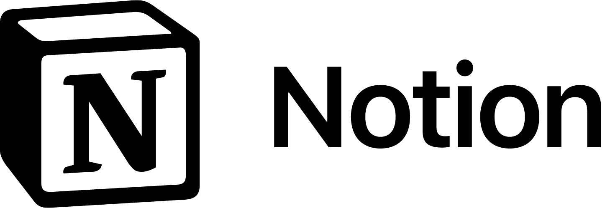

    

## Sobre o Projeto

Este repositório é destinado ao projeto da disciplina de Requisitos de Software da FGA - UnB. Nele, aplicaremos os conhecimentos adquiridos ao longo da disciplina a respeito de gerência (pré-rastreabilidade, pós-rastreabilidade), elicitação, modelagem, análise etc no estudo e documentação do aplicativo Notion.

## Sobre o Notion

Trata-se de uma ferramenta no-code para gerenciamento de projetos, tomada de notas e acompanhamento de atividades lançada em 2016, que unifica as informações relacionadas a cada uma dessas tarefas em um só local, facilitando assim a visualização de seu andamento, bem como sua edição e eventual realocação, seja de forma individual ou colaborativa.

Pense, por exemplo, no caso de um usuário que esteja agregando informações sobre as vagas de emprego para as quais aplica em uma pasta. Recorrentemente, ele deseja saber para quantas e para quais vagas aplicou, seu status (respondido, vídeo-apresentação pendente etc) e quando mandou o currículo. É evidente que se ele mantiver as informações armazenadas da forma como estão, terá dificuldades para realizar uma consulta, sobretudo se ela envolver múltiplos filtros.

Com o Notion, ele pode definir quais características o interessam e agregar todas as informações sobre as vagas e aplicações em um só lugar, podendo filtrá-las por quaisquer critérios que desejar.

## Equipe

<table>
    <tr style="text-align: center">
        <td>
            <a href="https://github.com/Arthurlima544">
                 
                Arthur Lima
            </a>
        </td>
        <td>
            <a href="https://github.com/berssutti">
                          
                Bernardo Pissutti
            </a>
        </td>
        <td>
            <a href="https://github.com/ciceroff">
                 
                Cícero Fernandes
            </a>
        </td>
        <td>
            <a href="https://github.com/dev-brito">
                                  
                Guilherme Brito
            </a>
        </td>
        <td>
            <a href="https://github.com/leonardomilv3">
                          
                Leonardo Vitoriano
            </a>
        </td>
        <td>
            <a href="https://github.com/ngm1450">
                          
                Nícolas Georgeos
            </a>
        </td>
    </tr>
</table>

## Referências Bibliográficas

O que é e como usar o Notion [Guia para iniciantes]. Disponível em: https://tecnoblog.net/responde/o-que-e-e-como-usar-o-notion-guia-para-iniciantes/. Acesso em: 11/07/2022

## Histórico de Versões

| Versão | Data       | Descrição                          | Autor             | Revisor |
| ------ | ---------- | ---------------------------------- | ----------------- |---------|
| 1.0    | 25/06/2022 | Criação da página                  | Bernardo Pissutti | Todos   |
| 1.1    | 27/06/2022 | Estilização da Página              | Guilherme Brito   | Todos   |
| 1.2    | 28/06/2022 | Edição de Texto sobre o Aplicativo | Cícero Fernandes  | Todos   |
| 1.3    | 13/07/2022 | Transição para o aplicativo Notion | Nicolas Mantzos   | Todos   |
