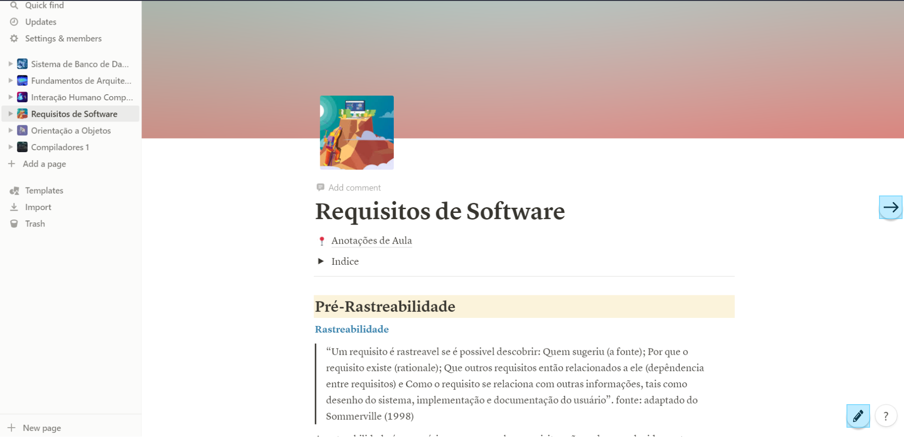
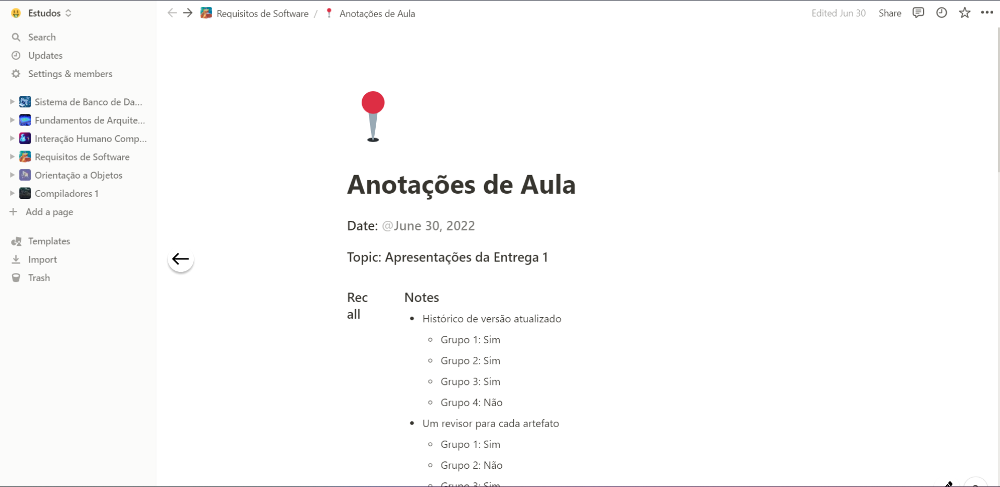

#  Validação - Prototipagem

## 1. Introdução

Na etapa de elicitação de requisitos foram elicitados requisitos que seriam interessantes
serem implementados no aplicativo do Notionl Assim, o protótipo foi construido penssando
em validar a usabilidade desse requisitos no aplicativo.

## 2. Metodologia

O origem do protótipo vem dos [Requisitos Funcionais](elicitacao/resultado.md), mais especificamente os RF34 e RF35.

## 3. Protótipo

### 3.1 Tela inicial
Na tela inicial, adicionamos dois butões, onde o usuário poderá ter acesso às duas novas funcionalidades implementadas.
O botão com o icone de uma caneta corresponde ao requisito funcional RF34, ja o botão com o icone de seta corresponde
ao requisito funcional RF35, como mostra a _Figura 1_.

|  |
|---------------------------------------------------------------|
| Figura 1: Tela inicial do protótipo; Fonte: Autoria Própria.  |

### 3.2 Caneta Digital - RF34

Ao clicar no botão da caneta o aparecera um barra de ferramentas no topo da tela que o usuário poderá
utilizar para editar o caderno digital como bem entender. E para voltar à tela normal do aplicativo
basta clicar de novo no botão, que agora está com um icone de teclado, como mostra a _Figura 2_

|  |
|-------------------------------------------------------------------|
| Figura 2: Barra de ferramentas; Fonte: Autoria Própria.           |

### 3.3  Passar pagina para o lado - RF35

Caso o usuário queira passar para a próxima página agora ele pode clicar no botão da seta e será direcionado
para a proxima página(a página logo a baixo) na lista da barra laterial, e caso o usuário queira voltar para a
página que ele estava anteriormente basta clicar na seta apontado para a direção contrária.

|                    |
|------------------------------------------------------------------------|
| Figura 3: Próxima págima quando clica na seta; Fonte: Autoria Própria. |

| Versão | Data       | Descrição           | Autor              | Revisor |
|--------|------------|---------------------|--------------------|---------|
| 1.0    | 17/08/2022 | Criação do artefato | Bernardo Pissutti  | Nicolas |
