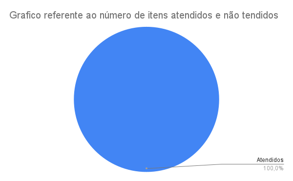
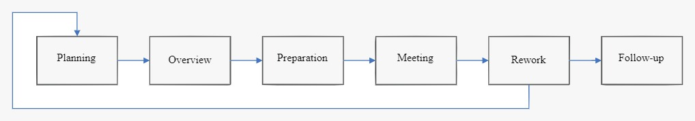

# Verificação

## 1. Introdução

Segundo _Serrano_, a verificação pode ser entendida como _uma análise de modelos sem que haja direta comparação com o Universo de Informações_, sendo essa análise uma tarefa desempenhada tanto por seres humanos quanto por software, seguindo regras bem definidas e cujo objetivo principal é analisar se os artefatos estão sendo construídos corretamente.

## 2. Metodologia

As verificações utilizarão, primariamente, as seis etapas definidas pelo método de Fagan (1976) adaptadas. Sendo elas:

### 2.1 Planejamento (*Planning*)

O objetivo é organizar o ambiente, físico ou virtual, no qual a inspeção se dará, reunindo os participantes e separando os materiais necessários.

### 2.2 Visão Geral (*Overview*)

Nesta etapa, os participantes da tarefa de inspeção são deixados a par dos materiais em análise e funções são atribuídas a cada um deles, determinando quem avaliará qual artefato.

### 2.3 Preparação (*Preparation*)

Nesta etapa, segundo Fagan, *os participantes revisam o item a ser inspecionado e o material de apoio, anotando quaisquer dúvidas ou possíveis defeitos encontrados.*
Nesse sentido, optamos por elicitar e listar os "defeitos encontrados" como perguntas advindas da avaliação do professor nas apresentações, dos monitores nos relatórios e da bibliografia, a fim de cobrir os aspectos mais variados e relevantes do artefato.
Cada pergunta estará acompanhada de um identificador para referência posterior, como consta na tabela exemplificativa 1 abaixo.

| Pergunta        | Identificador   |
|-----------------|-----------------|
| _p1_ | _i1_ |
| _p2_ | _i2_ |
| _p3_ | _i3_ |
| ...             | ...             |
| _pn_ | _in_ |

_Tabela 1: Tabela exemplificativa de itens e seus identificadores_

### 2.4 Inspeção (*Meeting/Inspection*)

Aqui, os defeitos são encontrados. Para tal, os itens destacados na etapa de preparação serão inspecionados justapondo-os em uma tabela com duas colunas: _Identificador_ e _Situação_, referindo-se, respectivamente ao n-ésimo _in_ da tabela 1
e a um dos ícones da tabela 3. No caso, "✅" qualificando o item como "Atendido" e "❌" o tornando "Não atendido", como pode ser visto na tabela 2.

| Identificador   | Situação  |
|-----------------|-----------|
| _i1_ | ✅         |
| _i2_ | ✅         |
| _i3_ | ❌         |
| _i4_ | ✅         |
| ...             | ...       |
| _in_ | ❌         |

_Tabela 2: Tabela exemplificativa de inspeção de itens (checklist)_

| Símbolo   | Significado   |
|:---------:|:-------------:|
|     ✅     |   Atendido    |
|     ❌     | Não atendido  |

_Tabela 3: Símbolos utilizados nas checklists e seus significados_

A partir dessa resposta, um gráfico de pizza como o da figura 1, compilando a porcentagem de itens atendidos e
não atendidos, será montado para facilitar a análise dos resultados e melhorar o rastreamento dos itens
nas próximas fases.

|                                       |
|-------------------------------------------------------------------------------------------|
| _Figura 1: Exemplo de gráfico de itens atendidos e não atendidos; Fonte: autoria própria_ |

Por fim, haverá uma conclusão determinando se o artefato deve ou não ser corrigido, quais pontos devem ser priorizados em uma eventual correção etc

### 2.5 Correção/retrabalho (*Rework*)

A correção (ou retrabalho) é a *etapa na qual os defeitos encontrados durante a inspeção são resolvidos pelo autor, projetista ou programador*.
Para esta fase, portanto, foi(ram) alocado(s) o(s) membro(s) da equipe responsável(eis) pela criação do artefato.

### 2.6 Acompanhamento (*Follow-up*)

Na fase de acompanhamento, todos os defeitos devem ser efetivamente corrigidos, sendo de responsabilidade de um
moderador verificar se isso realmente aconteceu. Além disso, ele deve se certificar de que nenhum novo defeito foi introduzido no processo de correção.
Foi alocado, para esse papel, um membro da equipe que não realizou a inspeção nem participou da criação do artefato, objetivando evitar enviesamento.

O fluxo do processo de inspeção de Fagan pode ser observado na figura 2 abaixo.

|  |
|-------------------------------------------------------------|
| Figura 2: Fluxo da inspeção de Fagan; Fonte: .              |

## 3. Verificação

### 3.1 Pré-Rastreabilidade

[Verificação 01 : Rich Picture](analise/verificacoes/verif_richPicture.md) 

### 3.2 Elicitação

[Verificação 01 : Perfil de Usuário](analise/verificacoes/verificacao_perfil_de_usuario.md) 
[Verificação 02 : Personas](analise/verificacoes/verificacao_personas.md) 
[Verificação 03 : Introspecção](analise/verificacoes/verificacao_introspeccao) 
[Verificação 04 : Brainstorming](analise/verificacoes/verificacao_brainstorming.md) 
[Verificação 05 : Priorização](analise/verificacoes/verificacao_priorizacao) 

### 3.3 Modelagem

[Verificação 01 : Cenários](analise/verificacoes/verif_cenarios.md) 
[Verificação 02 : Léxicos](analise/verificacoes/verificacao_lexicos) 
[Verificação 03 : Casos de Uso](analise/verificacoes/verif_casosUso.md) 
[Verificação 04 : NFR-Framework](analise/verificacoes/verificação_nfr_framework.md) 
[Verificação 05 : Backlog](analise/verificacoes/verificacao_backlog.md) 

## Referências Bibliográficas

SERRANO, Maurício; SERRANO, Milene. Requisitos - Aula 20. Material apresentado para a disciplina de Requisitos de Software no curso de Engenharia de Software da UnB, FGA.

Fagan, M. (1976) Design and Code Inspections to Reduce Errors in Software Development. IBM Systems Journal, 15, 182-211.

## Histórico de Versões

| Versão   | Data       | Descrição         | Autor              | Revisor  |
|----------|------------|-------------------|--------------------|----------|
| 1.0      | 15/08/2022 | Criação da página | Leonardo Vitoriano | Todos    |
| 1.1      | 12/09/2022 | Alteração página |Arthur | -    |

# Verificação

Tendo em vista o método de inspeção escolhido para realizar as verificações dos artefatos,
foi levado em conta as etapas definadas por FAGAN(1976).
## 1. Processo de Inspeção

### 1.1 Planejamento

Os artefatos de verificação devem possuir o contexto que se realiza a inspeção. Deve
ser detalhado a técnica utilizada, o documento a ser inspecionado, o autor do documento e 
o autor da inspeção.

### 1.2 Apresentação

Essa etapa foi omitida pois os inspetores possuem conhecimento sobre o projeto e os artefatos que devem
ser inspecionados.

### 1.3 Reunião

Uma reunião em equipe ocorre, envolvendo o moderador, os inspetores e os autores do documento. Discrepâncias são discutidas, e classificadas como defeito ou falso positivos.

### 1.4 Preparação

Os inspetores devem estudar o artefato individualmente, e eventualmente fazer anotações sobre estees produzindo
uma lista de descrepâncias.

### 1.5 Retrabalho

O autor do artefato inspecionado deve corrigir os defeitos encontrados pelos inspetores e confirmados pelo moderador

### 1.6 Acompanhamento

O meterial corrigido pelos autores é repassado para o moderador, que faz uma análise da inspeção como um todo e re-avalia
qualidade do artefato inspecionado.

