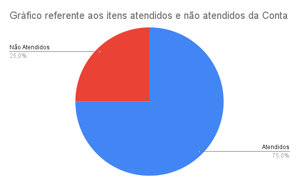
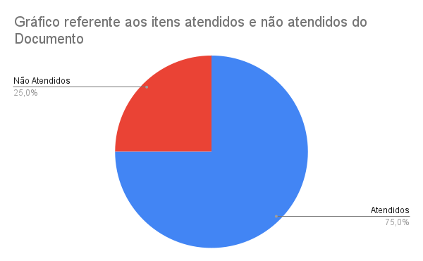
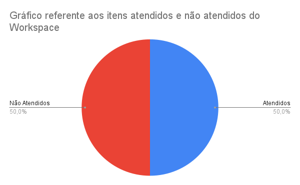

# Verificação do Caso de Uso

## 1. Introdução

Neste artefato será feita a checklist de avaliação do artefato sobre
<a href="https://requisitos-de-software.github.io/2022.1-Notion/#/modelagem/casos_de_uso">Casos de Uso</a>,
utilizando a metodologia e as estratégias descritas no documento de [Verificação](/analise/verif_principal.md).

- Autor do documento: Guilherme Brito.
- Inspetor: Leonardo Vitoriano.

## 2. Verificação

### 2.1 Preparação

O *checklist* da tabela 1 foi montado para verificar a qualidade do artefato.

| Item                                                         | Identificador |
|--------------------------------------------------------------|---------------|
| Possui ator(es)?                                             | 1             |
| O(s) ator(es) esta(ão) do lado correto do limite do sistema? | 2             |
| O(s) ator(es) possuem associação com Caso de Uso?            | 3             |
| Existe multiplicidade entre ator(es) e Caso de Uso?          | 4             |
| Possui relação de extend ou include?                         | 5             |
| Os Casos de Uso estão no infinitivo?                         | 6             |
| Existe limite do sistema?                                    | 7             |
| O fluxo principal está correto?                              | 8             |   
| O fluxo de exceção está correto?                             | 9             |   
| A notação do diagrama é respeitada?                          | 10            |   
| Possui rastreabilidade?                                      | 11            |   
| Uso de linguagem compreensível ao público?                   | 12            |   

_Tabela 1: Itens e identificadores da verificação do Planejamento da Análise de Tarefas_

_Obs: a pergunta 7 foi retirada da checklist do projeto [Prefeitura de Concordia](https://interacao-humano-computador.github.io/2021.1-Prefeitura-de-Concordia/verificacao/entrevistas/)_

### 2.2 Inspeção

A inspeção foi realizada pelo integrante Leonardo Vitoriano no dia 15/08/2022.
O resultado do inspeção dos itens levantados consta na _tabela 2_ abaixo.

| Item da Checklist | UC-Conta | UC-Documento | UC-Workspace |
|-------------------|----------|--------------|--------------|
| 1                 | ✅        | ✅            | ✅            |
| 2                 | ✅        | ✅            | ✅            |
| 3                 | ✅        | ✅            | ✅            |
| 4                 | ❌        | ❌            | ❌            |
| 5                 | ✅        | ✅            | ✅            |
| 6                 | ✅        | ✅            | ❌            |
| 7                 | ✅        | ✅            | ✅            |
| 8                 | ✅        | ✅            | ✅            |
| 9                 | ❌        | ❌            | ❌            |
| 10                | ✅        | ✅            | ❌            |
| 11                | ❌        | ❌            | ❌            |
| 12                | ✅        | ✅            | ❌            |

_Tabela 2: resultado do checklist_

As Figuras 1, 2 e 3 representam gráficos de pizza que foram construídos utilizando da Ferramenta:
Google Sheets para melhor rastreamento dos itens nas próximas fases.

|                            |
|----------------------------------------------------------------------------------------|
| Figura 1: Gráfico de Itens atendidos e não atendidos da Conta; Fonte: autoria própria. |

|                              |
|----------------------------------------------------------------------------------------------|
| Figura 2: Gráfico de Itens atendidos e não atendidos do Documento; Fonte: autoria própria.   |

|                              |
|----------------------------------------------------------------------------------------------|
| Figura 3: Gráfico de Itens atendidos e não atendidos do Workspace; Fonte: autoria própria.   |

De acordo com a verificação utilizando a checklist desenvolvida, é possível notar que os
itens 4, 9, 10 e 11 da Checklist em Casos de Uso não foram cumpridos, portanto o artefato Casos de Uso necessita de correções.

## Referências Bibliográficas

SERRANO, Maurício; SERRANO, Milene. Requisitos - Aula 07. 1º/2019. 50 slides. Material apresentado para a disciplina de Requisitos de Software no curso de Engenharia de Software da UnB, FGA.

## Hitórico de Versões

| Versão  | Data       | Descrição                                  | Autor              | Revisor           |
|---------|------------|--------------------------------------------|--------------------|-------------------|
| 1.0     | 15/08/2022 | Criação do Contexto, Checklist e Conclusão | Leonardo Vitoriano | Bernardo Pissutti |
