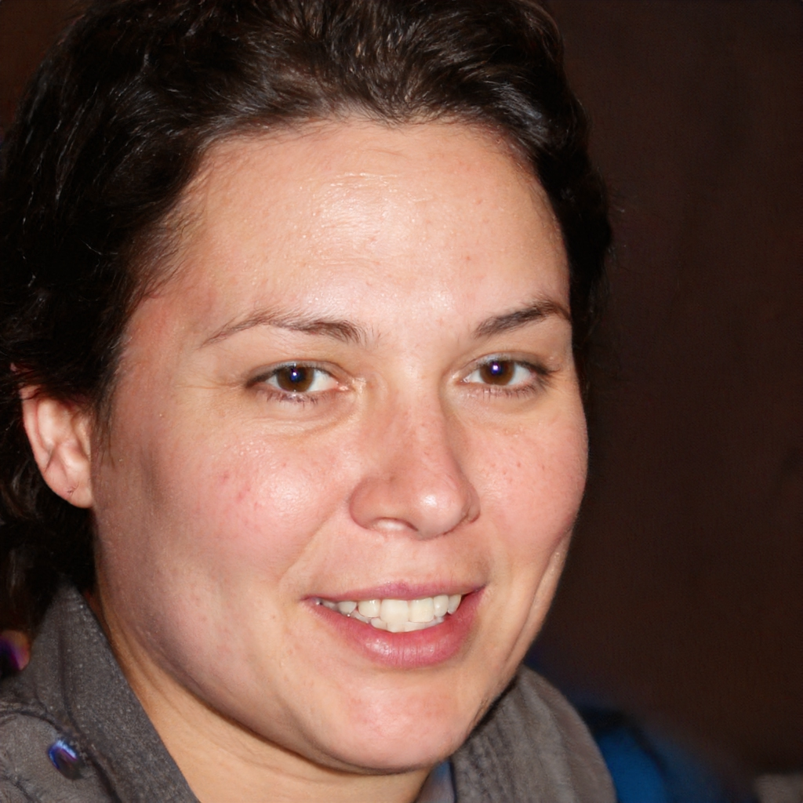
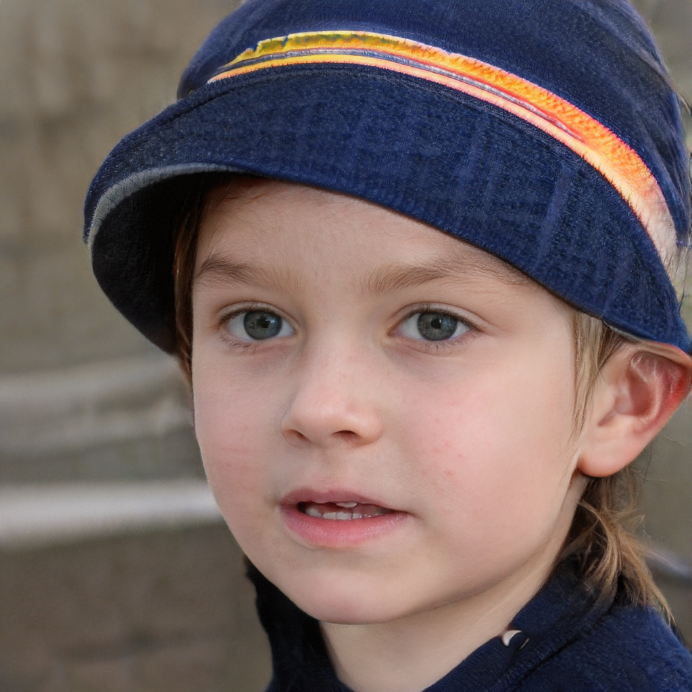

# Perfil de Usuário

Perfil de usuário é uma descrição detalhada das características dos usuários
cujos objetivos devem ser apoiados pelo sistema sendo projetado (Barbosa, 2021).
A partir dos dados coletados, com a técnica de elicitação de questionario (técnica 2 utilizada pela equipe), é possível então traçar perfis de usuários que possuem características semelhantes.

Perfil do Usuário: 

O usuário são pessoas que possuem contato ou facilidade com tecnologia, entre a faixa etária de 18 a 40 anos (jovens e adultos), grau de instrução a partir de Ensino Médio completo, e que buscam organizar, planejar e aumentar a produtividade com aplicativo "tudo-em-um".

# Personas

## 1. Introdução

As personas podem ser entendidas como sendo personagens fictícios que representam um grupo de usuários reais. Segundo Simone (2021, p.176), as personas são definidas principalmente por seus objetivos, que são determinados num processo de refinamentos sucessivos durante a investigação inicial do domínio de atividade do usuário.

## 2. Personas

### 2.1. Carlos da Silva:

||
|:----:|
|Imagem 1: Persona Carlos da Silva|

Carlos da Silva, estudante - "quanto mais prático melhor"
- Idade: 21.
- Sexo: Masculino.
- Profissão: Estudante.
- Escolaridade: Ensino Superior Incompleto (8° periodo).
- Expectativas: Deseja organizar suas atividades em um único lugar.

Descrição: Carlos da Silva tem 21 anos, namora e é um estudante da Universidade de Brasília (UnB). Ele reside com os pais e os 2 irmãos mais novos. Devido a sua rotina corrida, entre estudar para a faculdade, praticar exercícios na academia, ir nas aulas de inglês, namorar e ajudar a arrumar a casa, ele precisa ter tudo bem organizado com objetivo de não se perder.

Objetivos pessoais:
- realizar todos os afazeres e
- ter tudo organizado em um só lugar.

Objetivos práticos:
-  utilizar um sistema adequado para agrupar informações necessárias.
-  conseguir separar as atividades.
-  realizar anotações para cada disciplina. 
-  adicionar imagem dentro dos anotações.

### 2.2. Marina Costa:

||
|:----:|
|Imagem 2: Persona Marina Costa|

Marina Costa, engenheira de software - "quem planeja não se atrapalha"

- Idade: 26.
- Sexo: Feminino.
- Profissão: Engenheira de software.
- Escolaridade: Ensino Superior Completo.
- Expectativas: Deseja planejar suas atividades em um único lugar.

Descrição: Marina Costa possui 26 anos, formada em Engenharia de Software, e já é Desenvolvedora Pleno. Ela mora em Águas Claras, apartamento próprio e divide teto apenas com seus 4 gatos. Devido a facilidade dela com tecnologia em geral, ela organiza tanto a sua vida pessoal quanto profissional em 5 aplicativos. Porém, está insatisfeita com a perda de tempo em abrir e fechar os apps para encontrar onde está o planejamento que realizou para, no final, não encontrá-lo. Agora, ela procura um único app capaz de resolver o problema.

Objetivos pessoais:
- não perder tempo
- conseguir planejar  e
- organizar a vida pessoal e profissional.

Objetivos práticos:
-  utilizar um sistema adequado para agrupar informações necessárias.
-  adicionar quadro kanban. 
-  criar tabelas com dias e horários para cada tarefa.
-  criar listas para cada atividade.

### 2.3. Marcelo Araújo:

||
|:----:|
|Imagem 3: Persona Marcelo Araújo|

Marcelo Araújo, empresário - "tempo é dinheiro"

- Idade: 38.
- Sexo: Masculino.
- Profissão: Empresário.
- Escolaridade: Ensino Superior Completo.
- Expectativas: Deseja aumentar sua produtivididade.

Descrição: Marcelo Araújo possui 38 anos, formado em Administração, e é Empresário no ramo alimentício. Ele mora em um apartamento em Taguatinga, juntamente com sua esposa. Marcelo possuí 1 loja de hambuguer, em Taguatingua, mas procura expandir seu negócio por Brasília toda. Porém, ele mantém os registros de fluxo de caixa da sua empresa em vários cadernos, e muitas vezes não possui o total controle dos gastos, o que prejudica na organização do seu comércio e na tomada de decisão em expandi-lo. 

Objetivos pessoais:
- não perder tempo.
- ser mais produtivo  e
- organizar sua empresa.

Objetivos práticos:
-  utilizar um sistema adequado para agrupar informações necessárias.
-  definir metas para serem atingidas em um determinado tempo.
-  organizar fluxo de caixa em tabelas. 
-  escrever anotações nas páginas criadas.
-  definir listas de tarefas para seus funcionários.

## 3. Antipersona
### 3.1 Julio Almeida:

||
|:----:|
|Imagem 4: Antipersona Julio Almeida|

Julio Almeida, estudante - "brincar é melhor que estudar"

- Idade: 11.
- Sexo: Masculino.
- Profissão: Estudante.
- Escolaridade: Ensino Fundamental 2 Incompleto.
- Expectativas: Deseja brincar e não se preocupar com as tarefas de casa.

Descrição: Julio Almeida possui 11 anos, é estudante da escola Notre Dame, adora jogar bola, brincar com os amigos e assistir animes. Ele mora no Lago Sul e compartilha sua morada com seus pais e sua avó materna. Em seu dia a dia, Julio está sempre conectado em seu celular, ora visualizando vídeos no Youtube ora jogando Clash Royale; às vezes tanto, que para que se concentre nos estudos, seus pais costumam confiscar seu telefone. Já nos finais de semana, ele gosta de ir ao clube, jogar bola com os amigos e assistir filmes engraçados com sua família. 

Objetivos pessoais:
- se divertir.

## Referências Biblioǵraficas
Barbosa, S. D. J.; Silva, B. S. da; Silveira, M. S.; Gasparini, I.; Darin, T.; Barbosa, G. D. J. (2021)
Interação Humano-Computador e Experiência do usuário. Autopublicação. ISBN: 978-65-00-19677-1.R

## Histórico de Versões
| Versão | Data       | Descrição         | Autor    |
|--------|------------|-------------------|----------|
| 1.0    | 12/07/2022 | Criação da Introdução, Personas e Antipersonas | Leonardo Vitoriano |
| 1.1    | 13/07/2022 | Criação do Perfil do Usuário | Leonardo Vitoriano |
