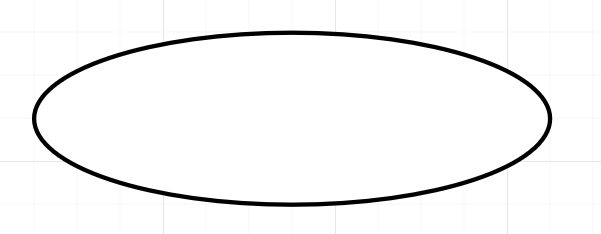
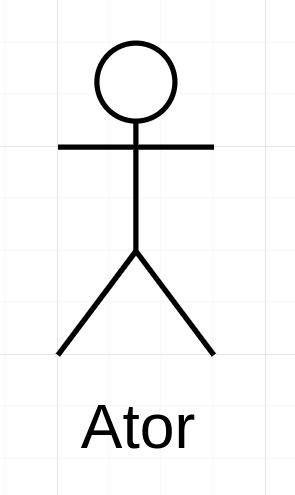
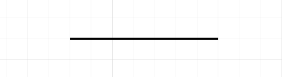
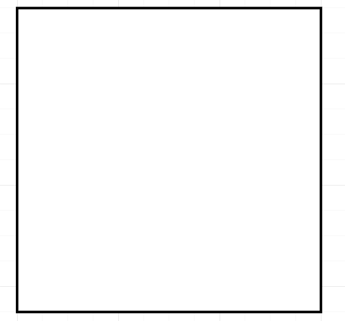

# Caso de Uso

Nessa seção, vamos definir e apresentar o diagrama de casos de uso referente ao app escolhido. Iremos definir primeiro *Caso de Uso*.

 

## Definição

Um caso de uso é uma espécie de classificador comportamental (um classificador que pode ter comportamentos definidos em seu contexto) que especifica uma unidade completa de uma funcionalidade útil executada por um ou mais assuntos aos quais o caso de uso se aplica em colaboração com um ou mais atores e que produz um resultado observável que é de algum valor para aqueles atores (ou outras partes interessadas) de cada assunto. 

Os casos de uso permitem capturar requisitos de sistemas sob projeto ou consideração, descrevendo a funcionalidade fornecida por esses sistemas e determinar os requisitos que os sistemas impôem em seu ambiente.

Para a organização e representação desses Casos de Uso, são usados os Diagramas de Caso de Uso. 

 
  
## Diagrama de Caso de Uso

Na Linguagem de Modelahem Unificada (UML), o diagrama de caso de uso resume os detalhes dos usuários do seu sistema (também conhecidos como atores) e as interações deles com o sistema, dando . Para criar um diagrama, um conjunto de símbolos e conectores especializados são utilizados.

Um bom diagrama de uso é capaz de ajudar uma equipe a representar e discutir:
-   Cenários em que o sistema ou aplicativo interage com pessoas, organizações ou sistemas externos.
-   Metas que o sistema ou aplicativo ajuda essas entidades a atingir.
-   O escopo do sistema.

O kit de símbolos pode ser visto na tabela abaixo.

| Símbolo | Significado | Representação Gráfica |
|:--:|:--:|:--:|
| Forma Oval Rotulada | Caso de Uso: Representam os diferentes usos que um usuário pode ter.| </img> |
| Bonecos Palito | Atores: Representando as pessoas que realmente executam os casos de uso. |</img>|
| Linha entre Ator e Caso de Uso | Participação do Ator no Sistema: Nos diagramas complexos, é importante saber quais atores estão associados a quais casos de uso.  |</img>|
| Retângulo englobando os Casos de  Uso (Forma Oval Rotulada)  | Limite do Sistema: Define um escopo do sistema para os casos de uso. |</img>|

> Tabela 1: Coleção de Elementos do Kit UML para criação do Diagrama de Casos de Uso

 
 
 

Para uma melhor percepção do sistema, podemos incluir também relações do diagrama. Essas relações são representadas por um texto entre <<>> e é composta de dois casos, onde é explicado na tabela a seguir.

|Relação|Significado
|:--:|:--:|
| include | Relação de um caso de uso que para ter sua funcionalidade executada precisa chamar outro caso de uso |
| extend | Relação que identifica uma similaridade entre casos de uso porém com alguns passos novos inseridos no caso de uso extendido |
> Tabela 2: Coletânea de Relações em um Diagrama de Caso de Uso e seus significados

 
 

Após análise do app selecionado e tomando como base os requisitos elicitados na seção [Elicitação](../elicitacao/resultado.md), a construção dos Diagramas de Casos de Uso foi feita e pode ser vista nas imagens abaixo:

||
|:--:|
|Figura 1: Diagrama de Casos de Uso referentes a Autenticação |

||
|:--:|
|Figura 2: Diagrama de Casos de Uso referentes a Documentos |

||
|:--:|
|Figura 3: Diagrama de Casos de Uso referentes a Workspaces |

 

## Referências Bibliográficas

SERRANO, Maurício; SERRANO, Milene. Requisitos - Aula 07. 1º/2019. 50 slides. Material apresentado para a disciplina
de Requisitos de Software no curso de Engenharia de Software da UnB, FGA.

LUCIDCHART - Diagrama de Caso de Uso UML -  https://www.lucidchart.com/pages/pt/diagrama-de-caso-de-uso-uml.

UML DIAGRAMS - Use Case Diagrams -  https://www.uml-diagrams.org/use-case-diagrams.html

## Histórico de Versões

| Versão | Data       | Descrição                  | Autor             |
| ------ | ---------- | -------------------------- | ----------------- |
|  1.0   |   19/07/2022         |       Criação da Página e Incorporação de Texto Introdutório                     |       Guilherme Brito            |
