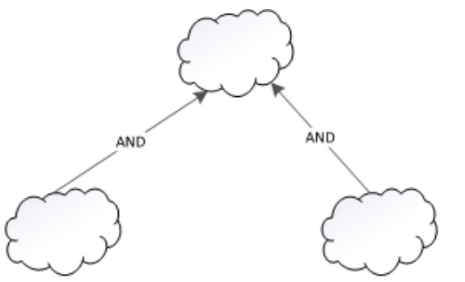
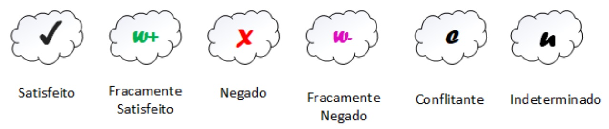
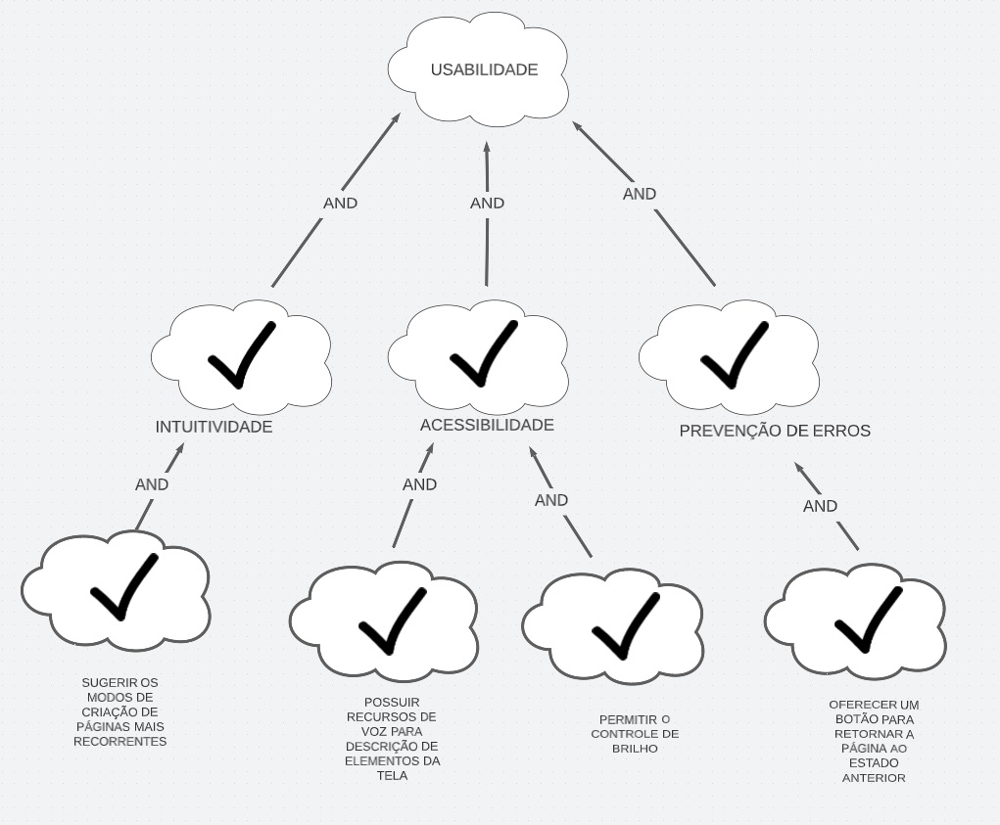
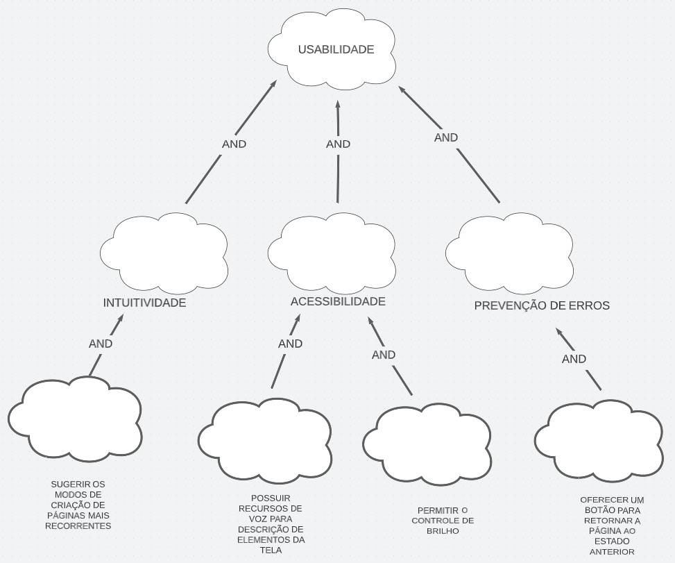

# NFR Framework

## 1. Introdução

NFR framework é um framework utilizado para manipular Requisitos Não-Funcionais expressando-os, conceitual e individualmente, por meio dos ditos <i>softgoals</i> - objetivos pouco precisos quanto à suas definição e 
seus critérios de satisfação - e grafica e coletivamente, através do chamado <i>SIG</i> (grafo de interdependência de softgoals).

Em termos práticos, objetiva decompor os requisitos não funcionais em níveis menores, aumentando sua granulidade, bem como criando inter-relacionamentos entre suas representações (<i>softgoals</i>), o que 
facilita a compreensão e a tarefa de priorização.

## 2. Legenda

Os softgoals se subdividem em três grupos; enquanto a definição dos relacionamentos entre eles, as chamadas <i>interdependências</i>, se ramificam em dois e os procedimentos de avaliação em seis.

### 2.1 Softgoals:

#### 2.1.1 NFR

Representam os Requisitos Não-Funcionais.

| Figura 1: Softgoal NFR       |
|----------------------------------------|
|  |
| Fonte: (CHUNG et al., 2000) |

#### 2.1.2 Operacionalização

Representam operações, processos e estruturações utilizados para satisfazer os softgoals NFR.

| Figura 2: Softgoal de Operacionalização |
|----------------------------------------|
|  |
| Fonte: (CHUNG et al., 2000) |

#### 2.1.3 Afirmação

Apoiam as tarefas de priorização e refinamento dos softgoals. Em suma, embasam as tomadas de decisão e os rumos do sistema.

| Figura 3: Softgoal de Afirmação        |
|----------------------------------------|
|  |
| Fonte: (CHUNG et al., 2000) |

### 2.2 Interdependências

### 2.2.1 Refinamentos:

Nesse tipo de interdependência, um softgoal pai de caráter geral se ramifica, de modo <i>Top-Down</i>, em dois ou mais filhos especializados.
Graficamente, esse ramificação pode ser realizada em qualquer um dos três tipos de sofgoals (NFR, operacionalização e adição) e é representada por um vetor
que parte dos filhos no sentido do pai (Figura 4).

| Figura 4: Exemplo de decomposição em softgoal NFR|
|----------------------------------------|
|  |

### 2.2.2 Contribuições:

Uma vez que sucessivas decomposições de sofgals pais e de seus filhos tenham sido realizadas, é importante poder mensurar o quanto cada
membro dos níveis inferiores contribuí para a satisfação dos níveis superioes e, portanto, dos requisitos não-funcionais como
um todo. Essa métrica é a chamada <i>contribuição</i> e pode ser visualizada graficamente por meio da inscrição de alguns dos termos abaixo nas setas 
que expressm a relação de decomposição. 

#### 2.2.1 Contribuição <i>AND</i>:
Se os <i>softgoals</i> descendentes forem satisfeitos os ascendentes também o serão. Exemplo na Figura 5.

#### 2.2.1 Contribuição <i>OR</i>:
Se ao menos um dos <i>softgoals</i> descendentes for satisfeito o ascendente também o será.

| Figura 5: Exemplo de contribuição <i>AND</i> entre sofgoals NFR|
|----------------------------------------|
|  |

### 2.3 Procedimento de avaliação:

O objetivo aqui é determinar em que medida um conjunto de decisões satisfaz os requisitos não funcionais, determinando se cada
softgoal ou interdependência do SIG foi suficientemente satisfeito. Para isso, são atribuídos rótulos aos softgoals conforme a Figura 6. 

| Figura 6: Rótulos utilizados pelos softgoals|
|----------------------------------------|
|  |
| Fonte: Baseado em (CHUNG et al., 2000) |

## 3. Diagramas
Optamos por destacar três categorias de requisitos importados do modelo FURPS - confiabilidade, usabilidade e desempenho.

### 3.1 Usabilidade - com propagação

|  |
|----------------------------------------|
| Figura 7: Análise com propagação do aspecto de usabilidade|

### 3.1 Usabilidade - sem propagação

|  |
|----------------------------------------|
| Figura 8: Análise sem propagação do aspecto de usabilidade|

## Referências Bibliográficas
https://www.cin.ufpe.br/~gta/rup-vc/core.base_rup/workproducts/rup_supplementary_specification_F5ACAA22.html

https://www.cin.ufpe.br/~gta/rup-vc/core.base_rup/guidances/checklists/supplementary_specifications_13D7A7B2.html

CHUNG, L.; NIXON, B. A.; YU, E.; MYLOPOULOS, J. Non-functional requirements
in software engineering. Springer Science & Business Media: [s.n.], 2000. v. 5.

## Histórico de Versões

| Versão | Data             | Descrição                                                   | Autor               |
| ------ |------------------|-------------------------------------------------------------|---------------------|
| 1.0    |   30/07/2021  |    Escrita da introdução, legenda e                                                         |                     |
