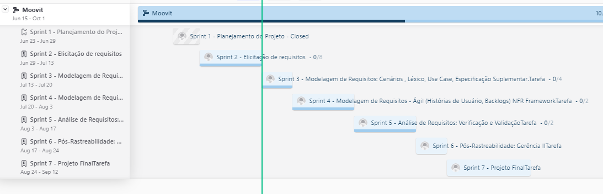
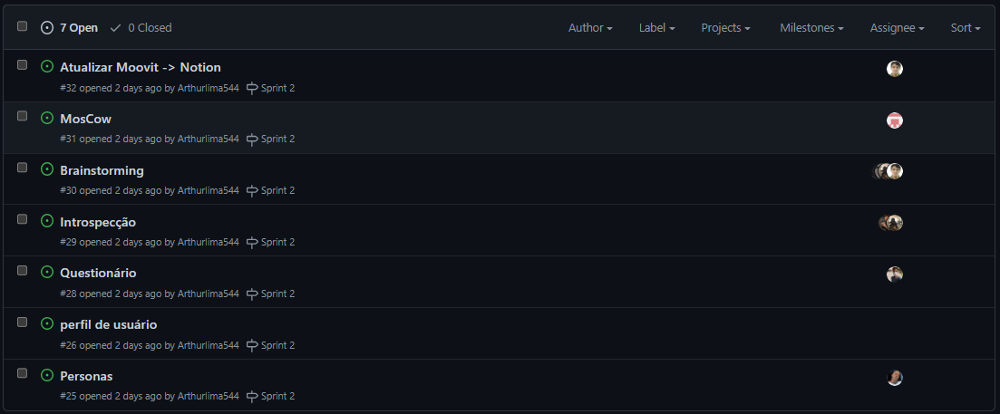
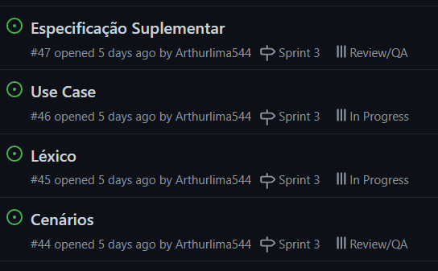
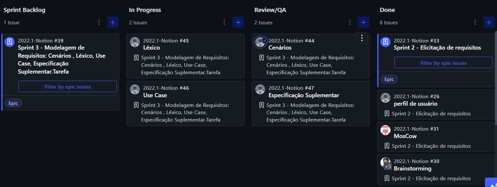

# Cronogramas

Neste artefato será documentado as datas das atividades do projeto, assim como os responsáveis por essas atividades e os revisores.
Também será documentado o roadmap de cada sprint e o kanban board.

## 1. Cronograma Geral das Atividades

Nessa seção, serão encontradas todas as entregas e apresentações a serem ministradas durante o período da disciplina, encontradas na _Tabela 1_

| Data  | Atividade                                                                                                                                                                                 |
| ----- | ----------------------------------------------------------------------------------------------------------------------------------------------------------------------------------------- |
| 29/06 | Entrega da apresentação do projeto etapa 1: Planejamento do Projeto, equipe, App selecionado para o projeto da disciplina, Ferramentas do projeto,cronograma das atividades, Rich Picture |
| 30/06 | Apresentação do projeto etapa 1: Equipe, Definição do APP e Planejamento do Projeto, Rich Picture                                                                                         |
| 13/07 | Entrega da apresentação do projeto 2: Elicitação – Técnicas e Priorização                                                                                                                 |
| 14/07 | Apresentação do projeto etapa 2: Elicitação – Técnicas e Priorização                                                                                                                      |
| 20/07 | Entrega da apresentação do projeto 3: Modelagem de Requisitos: Cenários , Léxico, Use Case, Especificação Suplementar                                                                     |
| 21/07 | Apresentação do projeto etapa 3: Modelagem de Requisitos: Cenários , Léxico, Use Case, Especificação Suplementar                                                                          |
| 03/08 | Entrega da apresentação do projeto etapa 4: Modelagem de Requisitos - Ágil (Histórias de Usuário, Backlogs, NFR Framework)                                                                |
| 04/08 | Apresentação do projeto etapa 4: Modelagem de Requisitos - Ágil (Histórias de Usuário, Backlogs, NFR Framework)                                                                           |
| 17/08 | Entrega da apresentação do projeto etapa 5: Análise de Requisitos: Verificação e Validação                                                                                                |
| 18/08 | Apresentação do projeto etapa 5: Análise de Requisitos: Verificação e Validação                                                                                                           |
| 24/08 | Entrega da apresentação do projeto etapa 6: Pós-Rastreabilidade - Gerência II                                                                                                             |
| 25/08 | Apresentação do projeto etapa 6: Pós-Rastreabilidade - Gerência II                                                                                                                        |
| 12/09 | Entrega da apresentação do projeto final                                                                                                                                                  |

_Tabela 1: Cronograma geral de atividades._

## 2. Cronograma Específico das Atividades

Nessa seção, serão encontradas as atividades específicas que foram trabalhadas para cada entrega da disciplina.

### 2.1 Primeira Entrega

A _Tabela 2_ aborda as atividades feitas para a primeira entrega.

| Data  | Atividade                                               | Responsáveis             | Revisores         |
| ----- | ------------------------------------------------------- | ------------------------ | ----------------- |
| 19/06 | Organização e separação das responsabilidades           | Todos                    | Todos             |
| 22/06 | Pesquisa outros repositórios                            | Guilherme Brito          | Todos             |
| 22/06 | Definição do cronograma                                 | Arthur e Cicero          | Todos             |
| 22/06 | Realização da base do git pages                         | Leonardo                 | Todos             |
| 22/06 | Definição das ferramentas utilizadas no projeto         | Bernardo                 | Todos             |
| 25/06 | Rich picture                                            | Leonardo e Nícolas       | Cicero            |
| 27/06 | Planejamento do projeto - metodologia, heatmap          | Bernardo                 | Guilherme Brito   |
| 27/06 | Planejamento do projeto - roadmap e configuração ZenHub | Arthur                   | Cicero            |
| 28/06 | Criação da página inicial do Projeto                    | Guilherme Brito e Cicero | Arthur e Bernardo |
| 28/06 | Gravação do projeto (síncrona)                          | Todos                    | Todos             |

_Tabela 2: cronograma da primeira entrega_

### 2.2 Segunda Entrega

A tabela 3 aborda as atividades feitas para a segunda entrega.

| Data  | Atividade                                            | Responsáveis                           | Revisores                              |
| ----- | ---------------------------------------------------- | -------------------------------------- | -------------------------------------- |
| 12/07 | Atualização das páginas do App de Moovit para Notion | Nícolas                                | Cícero                                 |
| 12/07 | Rich Picture para o Notion                           | Nícolas                                | Cícero                                 |
| 13/07 | Introdução das técnicas de priorização               | Guilherme Brito                        | Bernardo                               |
| 13/07 | Definição da técnica de introspecção                 | Bernardo e Cicero                      | Leonardo                               |
| 13/07 | Definição da técnica questionário                    | Arthur                                 | Nícolas                                |
| 13/07 | Definição das personas                               | Leonardo                               | Arthur                                 |
| 13/07 | Cronograma da segunda entrega                        | Cícero                                 | Todos                                  |
| 13/07 | Página de resultados                                 | Guilherme                              | Todos                                  |
| 13/07 | Gravação do vídeo da entrega 2                       | Todos                                  | Todos                                  |
| 13/07 | Brainstorming                                        | Arthur, Leonardo, Guilherme e Bernardo | Arthur, Leonardo, Guilherme e Bernardo |
| 13/07 | Definição da técnica de brainstorming                | Bernardo                               | Todos                                  |

_Tabela 3: cronograma da segunda entrega_

### 2.3 Terceira Entrega

A _Tabela 4_ aborda as atividades feitas para a terceira entrega.

| Data  | Atividade                                              | Responsáveis        | Revisores |
|-------|--------------------------------------------------------|---------------------|-----------|
| 14/07 | Definição das atividades e atribuição dos responsáveis | Todos               | Todos     |
| 20/07 | Cronograma da terceira entrega                         | todos               | Todos     |
| 18/07 | Adição do backlog                                      | Bernardo            | Todos     |
| 18/07 | Adição do quadro kanban                                | Bernardo            | Todos     |
| 16/07 | Especificação Suplementar                              | Bernardo            | Guilherme |
| 19/07 | Use Case                                               | Guilherme, Bernardo | Arthur    |
| 19/07 | Léxico                                                 | Cícero              | Nícolas   |
| 13/07 | Cenários                                               | Nícolas             | Leonardo  |
| 20/07 | Gravação do vídeo da entrega 3                         | Todos               | Todos     |

_Tabela 4: cronograma da terceira entrega_

## 3. Roadmap e Sprints 

O quadro kaban e o roadmap são elementos que irão nos ajudar durante o desenvolvimento do projeto, explicados melhor na seção de metodologia. Nessa seção será apresentado o desenvolvimento dos dois com o passar das entregas.

### 3.1 Roadmap

Apresentação do roadmap do zenhub da equipe, mostrando todas as sprints na _Figura 1_.

|  |
|----------------------------------------|
| _Figura 1: roadmap das sprints_        |

### 3.2 Sprints

#### 3.2.1 Sprint 1

O backlog da sprint 1 referente ao Épico: Planejamento do Projeto, representado na _Figura 2_.

|  |
| --------------------------------------------------------------------------------------------------------------- |
| _Figura 2: backlog da sprint 1_                                                                                 |

#### 3.2.2 Sprint 2

O backlog da sprint 2 referente ao Épico: Elicitação de requisitos, representado na _Figura 3_ e na _Figura 4_ o kanban board.

|  |
| -------------------------------------- |
| _Figura 3: backlog da sprint 2_        |

|        |
|---------------------------------------|
| _Figura 4: quadro kanban da sprint 2_ |

#### 3.2.3 Sprint 3

O backlog da sprint 3 referente ao Épico: Modelagem de Requisitos, representado na _Figura 5_, e na _Figura 6_ o kanban board.

|  |
|------------------------------------------|
| _Figura 5: backlog da sprint 3_          |

|  |
|----------------------------------------|
| _Figura 6: quadro kanban da sprint 3_  |

## Histórico de Versões

| Versão | Data       | Descrição                                                | Autor             |
|--------|------------|----------------------------------------------------------|-------------------|
| 1.0    | 22/06/2022 | Criação dos Cronogramas                                  | Arthur            |
| 1.1    | 28/06/2022 | Atualização do Cronograma                                | Arthur            |
| 1.2    | 13/07/2022 | Formatação da página                                     | Bernardo Pissutti |
| 1.3    | 13/07/2022 | Adição do cronograma da segunda entrega                  | Cícero            |
| 1.4    | 18/07/2022 | Adição do cronograma, backlog e kanban board da sprint 3 | Bernardo Pissutti |
