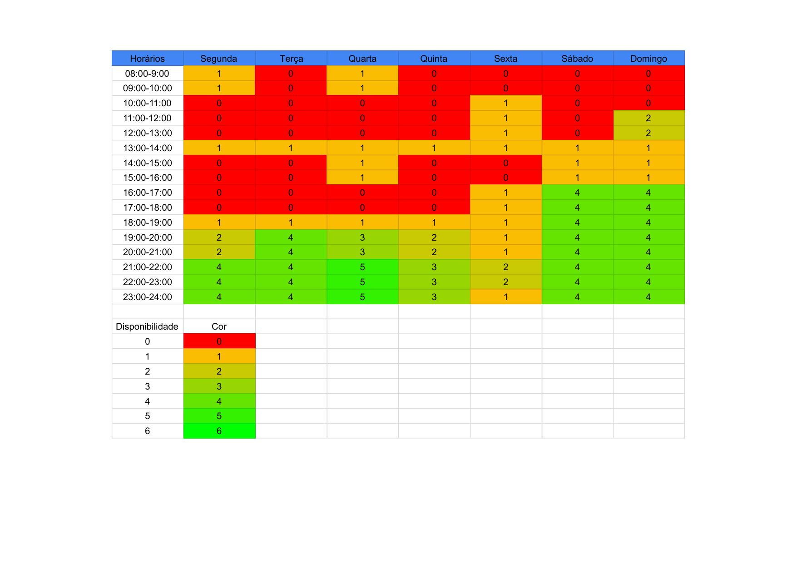

# Heatmap

O heatmap da _Figura 1_ tem por objetivo transparecer os horários livres dos membros da equipe, dessa forma é possível organizar e documentar os melhores dias e horários para a realização de reuniões.

|  |
|---------------------------------------------------|
| Figura 1: HeatMap; Fonte: autoria própria.        |

## Histórico de Versões

| Versão | Data       | Descrição                   | Autor             | Revisor         |
|--------|------------|-----------------------------|-------------------|-----------------|
| 1.0    | 25/06/2022 | Criação da página           | Bernardo Pissutti | Guilherme Brito |
| 1.1    | 25/06/2022 | Correção Imagem Heatmap     | Guilherme Brito   | -               |
| 1.2    | 13/07/2022 | Adição da legenda da imagem | Bernardo Pissutti | -               |
