# Figuras das Funcionalidades

## RF1

| 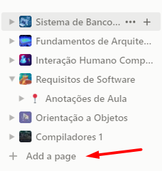  |
| ------------------------------------------------- |
| Figura 1: funcionalidade de criar uma página nova |

## RF2

| 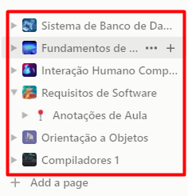 |
| ------------------------------------------------------ |
| Figura 2: funcionalidade de visualizar páginas criadas |

## RF3

| 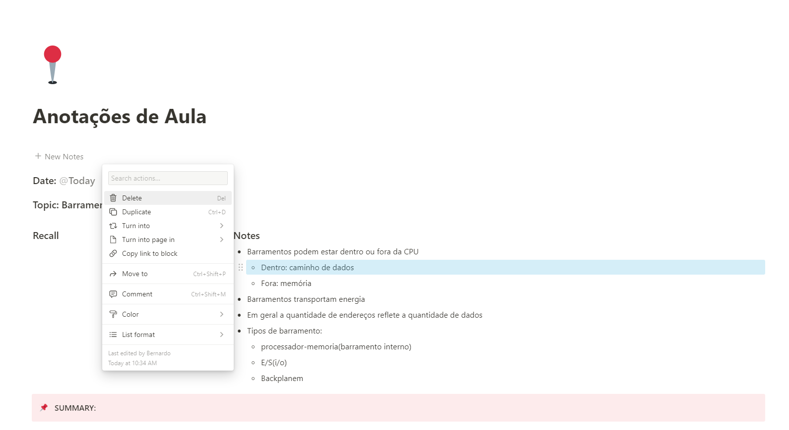 |
| ------------------------------------------------ |
| Figura 3: funcionalidade de editar página        |

## RF4

| 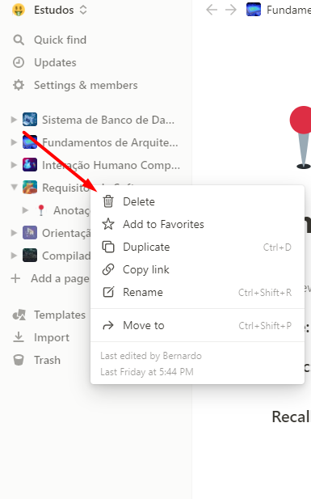 |
|--------------------------------------------------|
| Figura 4: funcionalidade de excluir página       |

## RF6

| 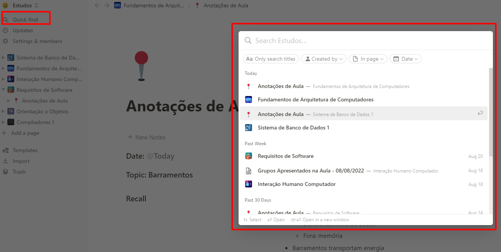               |
|----------------------------------------------------------------|
| Figura 5: funcionalidade de pesquisar por uma página já criada |

## RF7

| 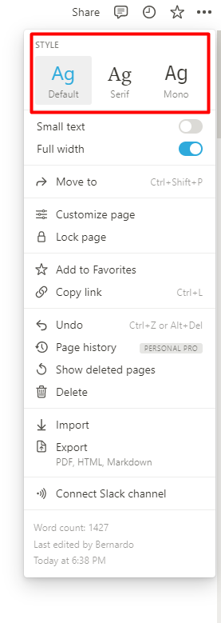   |
|----------------------------------------------------|
| Figura 6: funcionalidade de mudar fonte da página  |

## RF8
| 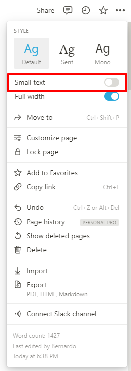 |
|------------------------------------------------------|
| Figura 7: funcionalidade de mudar o tamanho da fonte |

## RF9

| 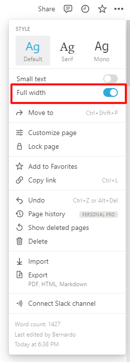     |
|-----------------------------------------------------------|
| Figura 8: funcionalidade de usar a lagura toda da página  |

## RF10
|                 |
|------------------------------------------------------------------|
| Figura 9: funcionalidade de ler o histórico de updates da página |

## RF11

|    |
|---------------------------------------------------|
| Figura 10: funcionalidade de favoritar uma página |

## RF12
| 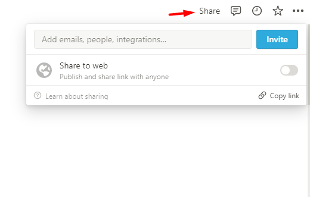                       |
|------------------------------------------------------------------------|
| Figura 11: funcionalidade de copiar o link da página para compartilhar |

## RF13

|        |
|-----------------------------------------------------------|
| Figura 12: funcionalidade de mudar a aparência do sistema |

## RF14

| 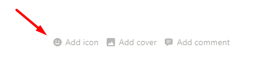                    |
|------------------------------------------------------------------------|
| Figura 13: funcionalidade de adicionar foto de identificação da página |

## RF15

| 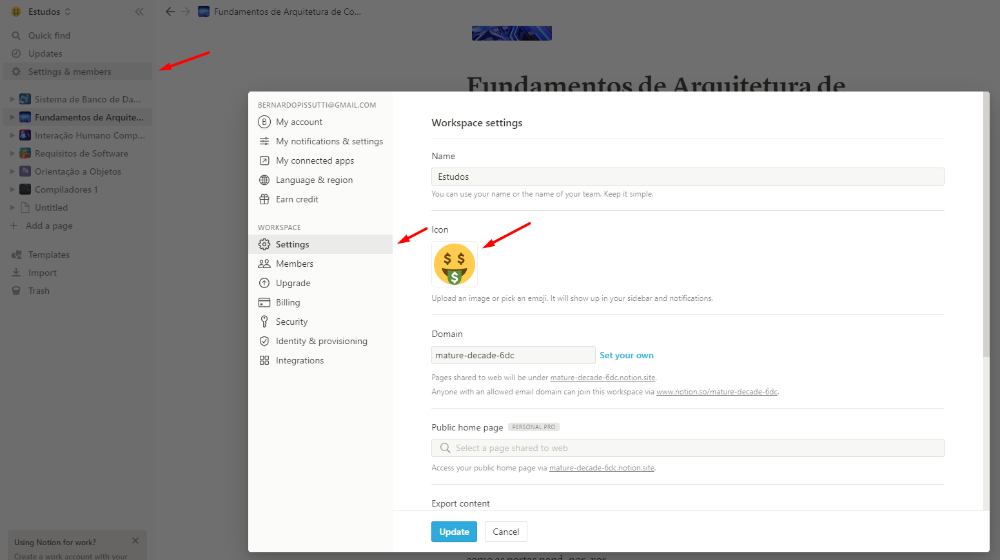                      |
|---------------------------------------------------------------------------|
| Figura 14: funcionalidade de adicionar foto de identificação ao workspace |

## RF17

| 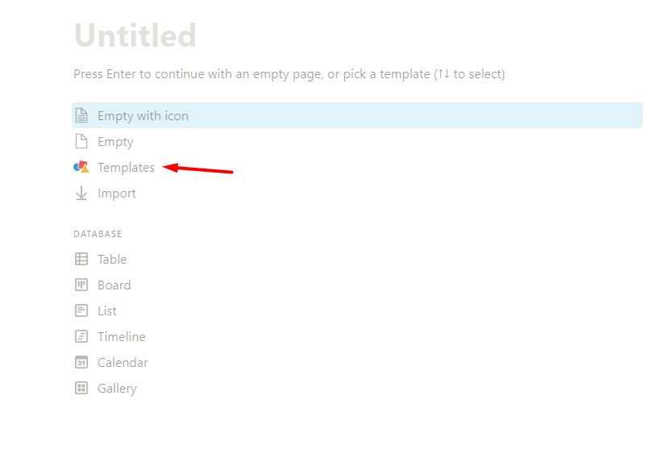         |
|--------------------------------------------------------------|
| Figura 15: funcionalidade de usar um template para a página  |

## RF18

| 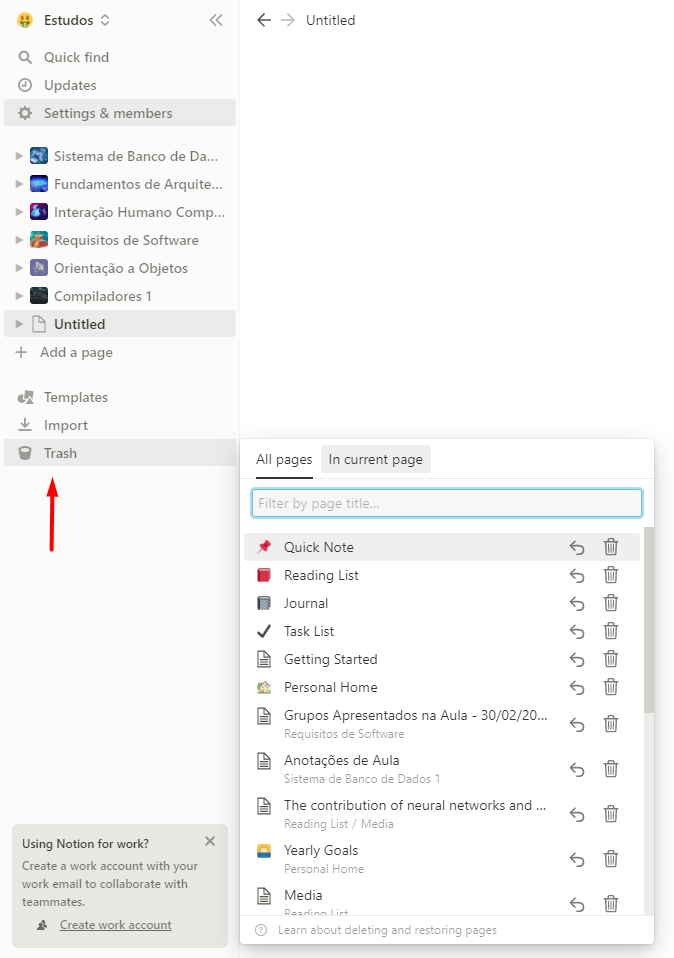                 |
|-----------------------------------------------------------------------|
| Figura 16: funcionalidade de adicionar histórico de páginas deletadas |

## RF19

|             |
|---------------------------------------------------------------|
| Figura 17: funcionalidade de importar arquivos de outros apps |

## RF20

| 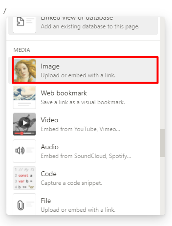 |
|-------------------------------------------------|
| Figura 18: Adicionar fotos na página            |

## RF21

| 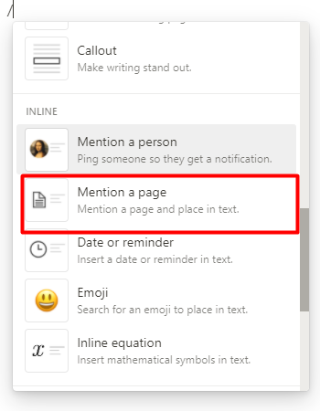             |
|---------------------------------------------------------------|
| Figura 19: Referenciar outras páginas dentro de alguma página |

## RF23

| 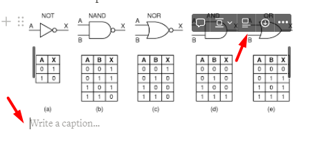 |
|-------------------------------------------------|
| Figura 20: Adicionar legendas nas imagens       |

## RF24

| 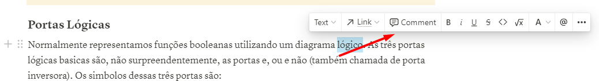 |
| ---------------------------------------------------- |
| Figura 21: Escrever comentários na página            |

## RF25

| 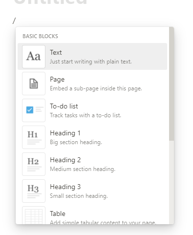 |
| --------------------------------------------------- |
| Figura 22: Criar bloco para editar as páginas       |

## RF26

|  |
| --------------------------------------------------- |
| Figura 23: Escolher entre opções de bloco           |

## RF27

| 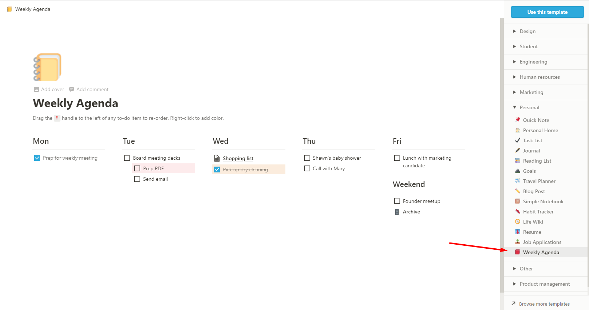 |
| ---------------------------------------------- |
| Figura 24: Criar agenda                        |

## RF28

| 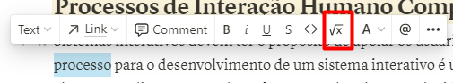 |
| -------------------------------------------------- |
| Figura 25: Criar equação matemática                |

## RF30

| 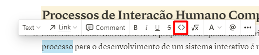 |
| --------------------------------------------------- |
| Figura 26: Criar bloco de código na página          |

## RF32

| 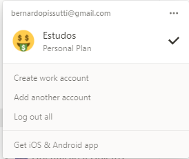 |
| --------------------------------------------------- |
| Figura 27: Criar conta                              |

## RF33

| 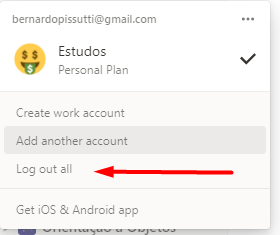 |
| ---------------------------------------------- |
| Figura 28: Fazer logout                        |

## Histórico de Versões

| Versão | Data       | Descrição         | Autor             |
| ------ | ---------- | ----------------- |-------------------|
| 1.0    | 24/08/2022 | Criação da página | Bernardo Pissutti |
