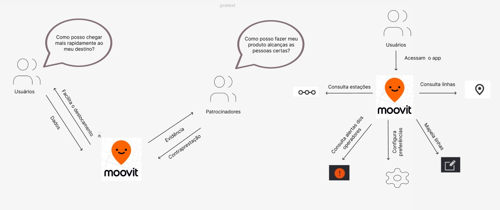
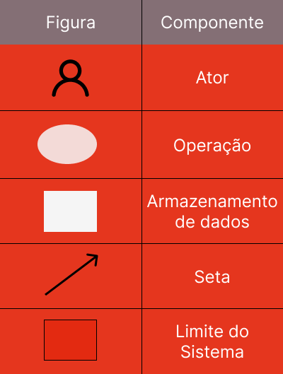

# Rich Picture

## 1. Introdução
Rich Pictures são *desenhos de contexto* que ilustram os elementos principais de uma situação (contexto) e os relacionamentos que precisam ser considerados, seja para intervir objetivando sua melhoria, seja para melhor compreendê-la.
Na prática, consiste em imagens, textos, símbolos e ícones ajustados de maneira relacionada.

Auxilia na visualização, em um nível maior de abstração, de relacionamentos e conexões que poderiam eventualmente passar despercebidos nas descrições textuais ou nos diagramas entidade-relacionamento tradicionais.

Optamos por criar duas rich pictures que descrevem visões macro (do que o sistema se trata, quais são suas funcionalidades mais gerais etc) e micro (como o usuário interage com as funcionalidades, o que obtém delas etc).
Em termos gerais, a primeira está mais propensa a ir além do chamado "limite do sistema" enquanto a segunda se restringe a ele.

## 2. Rich Pictures
### 2.1 Visão micro

<figcaption>Imagem 1: Rich Picture Micro versão 1.</figcaption>

### 2.2 Visão macro

<figcaption>Imagem 2: Rich Picture Macro versão 1.</figcaption>

### 2.3 Legenda 

A construção dos RichPictures, do aplicativo Moovit, foi baseada nos 5 elementos principais para a confecção de um bom Rich Picture, os quais, segundo Revadi(2018, p.4), são: os atores, as operações, os armazenamentos de dados, as setas e o limite do sistema. Os elementos citados podem ser encontrados na *Imagem 3*.

<figcaption>Imagem 3: Legenda Rich Pictures.</figcaption>

## Histórico de Versões
| Versão | Data       | Descrição                            | Autor             |
|--------|------------|--------------------------------------|-------------------|
| 1.0    | 26/06/2022 | Implementação inicial da página | Leonardo Milomes Vitoriano |
| 1.0.1    | 26/06/2022 | Adição da Rich Picture - Micro                 | Leonardo Milomes Vitoriano |
| 1.0.2   | 27/06/2022 | Adição da introdução, das referências e da Rich Picture - Macro           | Nícolas Georgeos Mantzos |
| 1.0.2   | 27/06/2022 | Correções gerais           | Nícolas Georgeos Mantzos |

## 3. Referências
Rich picture. MSP Guide. Disponível em: <https://mspguide.org/2022/03/18/rich-picture/>. Acesso em: 27 de jun. de 2022.

REVADI, Chindy Elsanna. Rich Picture Guidelines. CTEC2402 - Software Development
Project. Abril, 2018.
